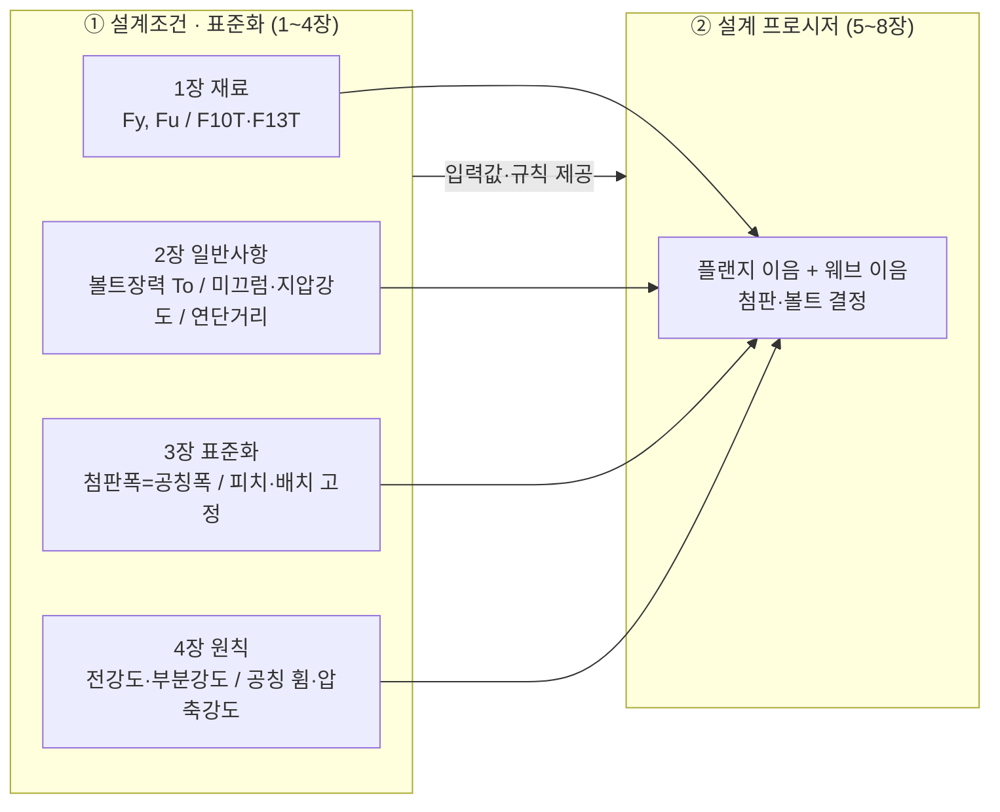
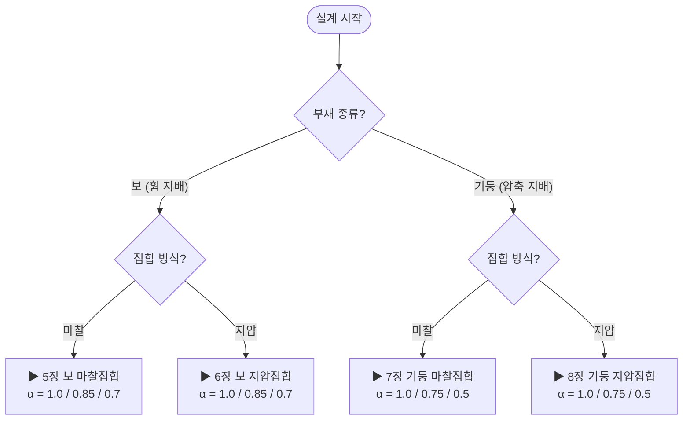
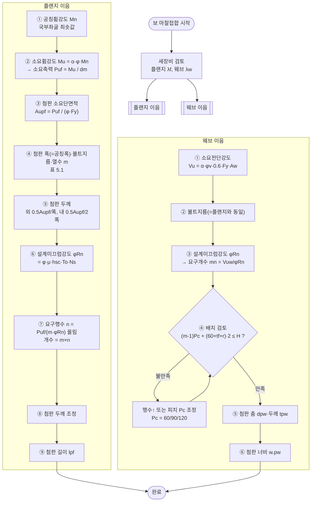
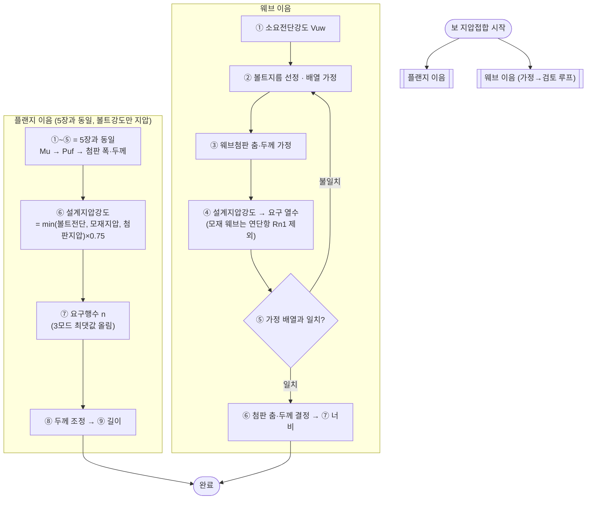
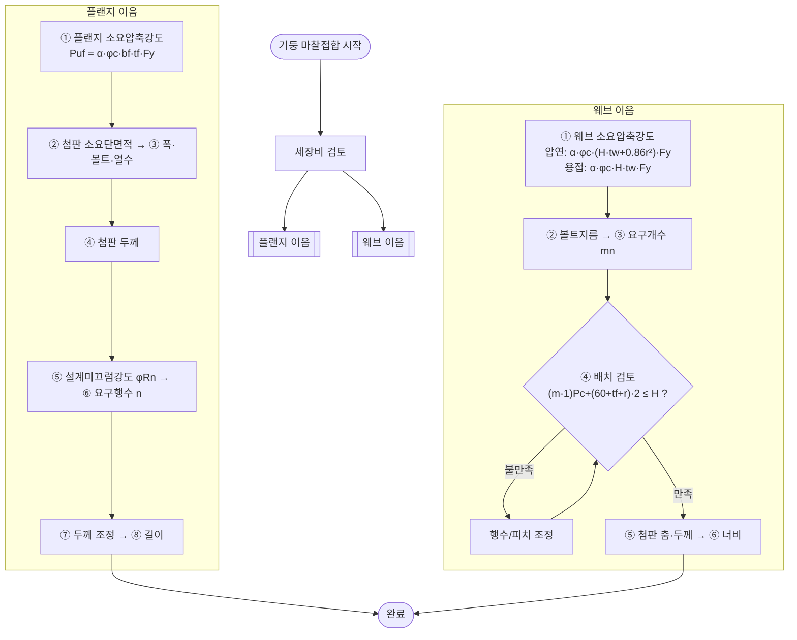
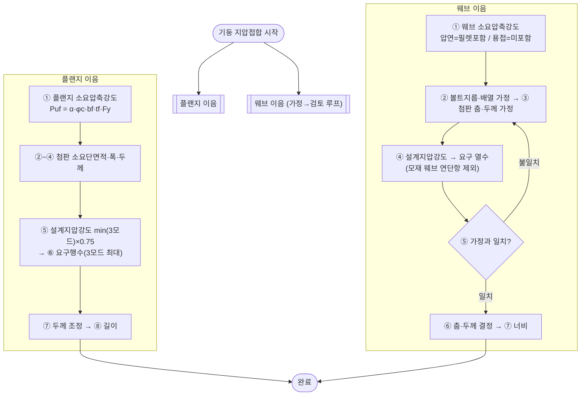

# 고력볼트 표준접합 설계 WORKFLOW

> 『고력볼트 표준접합 설계편람』(KSSC-M-09-03) 1~8장을 **한눈에 따라갈 수 있는 흐름도**로 정리.
> 상세 근거는 [`01_설계조건_표준화방안_1-4장.md`], [`02_설계_프로시저_5-8장.md`] 참조.
> ※ Mermaid 다이어그램은 GitHub·VS Code(Markdown Preview Mermaid) 등에서 렌더링됩니다.

---

## 1. 문서 연결 지도 — 조건(1~4장)이 절차(5~8장)로 흐르는 방식

**요점**: 1~4장은 "재료·강도·표준치수·소요강도 기준"이라는 **입력값과 규칙**을 확정하고, 5~8장은 그 값을 넣어 **첨판 두께·볼트 개수·배열**을 계산한다.

---

## 2. 시작점 — 접합 유형 선택 결정 트리

| 판단 | 결과 | 이유 |
|---|---|---|
| 부재 = 보 | 휨모멘트로 소요력 산정 | 4.1 |
| 부재 = 기둥 | 압축력으로 소요력 산정 | 4.2 |
| 마찰 선택 | 볼트강도 = 설계미끄럼강도(φ=0.85) | 2.4 |
| 지압 선택 | 볼트강도 = 설계지압강도(φ=0.75, 3모드 최솟값) | 2.5·2.6 |
| 지압 선택 시 | 하중비 < 1.43이면 **사용성 마찰접합 별도 검토** | 2.8 |

---

## 3. 【5장】 보 마찰접합 — 표준 절차 (다른 장의 기준)

**단계 설명 (플랜지)**

| 단계 | 입력 | 계산/판정 | 출력 |
|---|---|---|---|
| ① Mn | Zx, Sx, Fy, λ | 5.2.1·5.2.2 중 작은 Mn | 공칭휨강도 |
| ② Mu·Puf | Mn, α, dm | Mu=α·φ·Mn, Puf=Mu/dm | 플랜지 소요축력 |
| ③ Aupf | Puf, Fy | Puf/(φ·Fy), φ=0.9 | 소요단면적 |
| ④ 폭·m | 공칭폭 | 표 5.1 | 볼트 규격·열수 |
| ⑤ 두께 | Aupf, 폭 | 외·내 두께식 | 첨판 두께 |
| ⑥ φRn | To, μ | 표 1.7 ×0.85 | 볼트 단위강도 |
| ⑦ n | Puf, m, φRn | 올림(300mm=0.5단위) | 행수·개수 |
| ⑧ 조정 | 볼트강도 | 외/내 재배분 | 확정 두께 |
| ⑨ 길이 | n | 정렬/엇모식 | 첨판 길이 |

**단계 설명 (웨브)**: ① 전단으로 Vu 산정 → ③ 요구개수 → **④ 배치조건 루프**(행수 적게·피치 크게 우선, 춤≤200mm면 엇갈림) → ⑤⑥ 첨판.

---

## 4. 【6장】 보 지압접합 — 마찰과의 차이 강조 (웨브 재산정 루프)

| 마찰(5장)과 다른 점 | 내용 |
|---|---|
| 볼트 단위강도 | 미끄럼강도 → **지압강도**(3모드 최솟값 × 0.75) |
| 플랜지 요구행수 | 볼트전단·모재지압·첨판지압 **3종 중 최대** |
| 웨브 설계 | 직접 산정 → **"가정→검토→재산정" 루프** |
| 모재 웨브 | 연단부 없음 → 연단인접 지압항(Rn1) 제외 |

---

## 5. 【7장】 기둥 마찰접합 — 휨 대신 압축

| 보(5장)와 다른 점 | 내용 |
|---|---|
| 소요력 | 휨 Mu 대신 **압축 Puf = α·φc·bf·tf·Fy** |
| 웨브 소요력 | **압축**(압연=필렛 포함 / 용접=미포함) |
| 부분강도비 α | **1.0 / 0.75 / 0.5** (밀착접합 고려) |
| 이격거리 | 밀착접합(metal touch) 시 **0mm** |
| 나머지(첨판·볼트·배열) | 5장과 **동일** |

---

## 6. 【8장】 기둥 지압접합 — 압축(7장) + 지압(6장)

**8장 = 7장의 압축 소요력 + 6장의 지압 볼트강도·웨브 루프** 조합. 부분강도비 α = 1.0 / 0.75 / 0.5.

---

## 7. 빠른 참조 — 설계 완료 전 체크리스트

**입력 조건 (1~4장)**
- [ ] 강종 확정, `Fy`·`Fu` 확인 (표 1.2) — 첨판은 모재와 동일 강종
- [ ] 볼트 등급(F10T/F13T)·지름(M16/M20/M22) 선정, 플랜지=웨브 동일 지름
- [ ] 설계볼트장력 `To`(표 1.6), 마찰이면 미끄럼강도(표 1.7)/지압이면 강도(표 1.8) 확보
- [ ] 부재 구분(보=휨 / 기둥=압축), 부분강도비 α 결정
- [ ] 접합방식(마찰/지압) 결정, 지압이면 **하중비 ≥ 1.43** 또는 사용성 마찰 별도검토(2.8)

**표준 치수 (3장)**
- [ ] 플랜지 첨판 폭 = 형강 공칭폭, 첨판 두께 = 표 3.1/3.2 규격값
- [ ] 피치: 정렬 60 / 엇모 45mm, 웨브 상하피치 60·90·120mm
- [ ] 연단거리 40mm, 볼트중심 응력방향거리 60mm, 이격 10mm(밀착 0)

**플랜지 이음**
- [ ] 소요축력 `Puf` 산정 (보: Mu/dm / 기둥: α·φc·bf·tf·Fy)
- [ ] 볼트 열수 m(표 5.1/7.1), 요구행수 n (300mm는 0.5단위 올림)
- [ ] 외·내첨판 두께 조정, 첨판 길이 산정

**웨브 이음**
- [ ] 소요전단(보) / 소요압축(기둥) 산정
- [ ] 배치조건 `(m-1)Pc+(60+tf+r)·2 ≤ H` 만족, 행수 적게·피치 크게 우선
- [ ] 춤 ≤ 200mm면 웨브/플랜지 볼트 절반피치 엇갈림
- [ ] (지압) 가정 배열 = 설계 배열 일치 확인(불일치 시 재수행)
- [ ] 웨브 첨판 춤 ≥ 부재 춤의 60%, 두께·너비 확정

**최종 검토**
- [ ] 모든 부재(첨판)·볼트가 표준 규격 범위 내인지
- [ ] 과대·슬롯구멍, 나사부 전단면 포함 등 **표준접합 적용 제외 조건** 없는지
