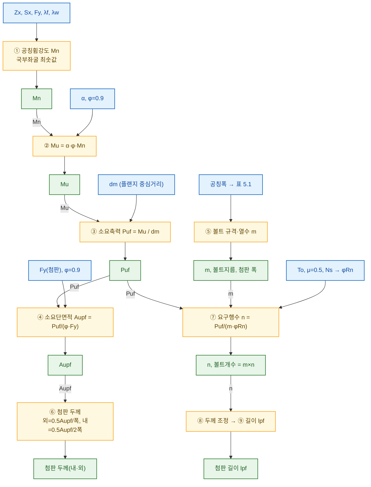
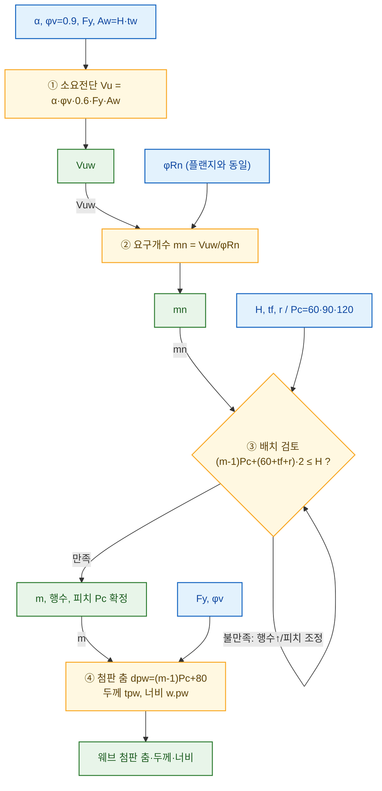
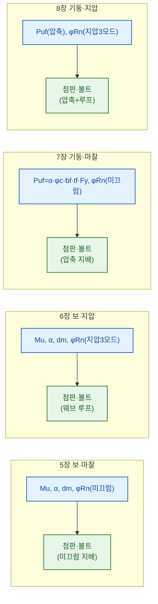
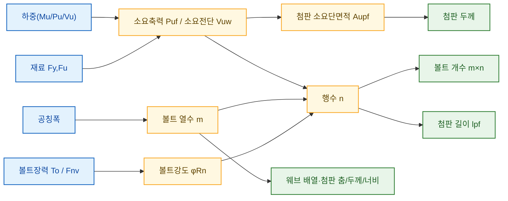

# 고력볼트 표준접합 설계 WORKFLOW — 입력값 · 결과값 시각화

> 각 설계 단계를 **【입력값】 → 〔계산〕 → 【결과값】** 흐름으로 시각화한 문서.
> 한 단계의 **결과값이 다음 단계의 입력값으로 연결**되는 관계(데이터 흐름)를 화살표에 표기.
> 순서 중심 흐름도는 [`03_설계_WORKFLOW.md`], 근거·수식은 [`02_설계_프로시저_5-8장.md`] 참조.

---

## 범례 (색상 규칙)

| 색 | 의미 |
|---|---|
| 🔵 파랑 | **입력값** — 재료·부재·표준표에서 주어지는 값 |
| 🟡 노랑 | **계산 단계** — 수식 적용 |
| 🟢 초록 | **결과값** — 그 단계에서 확정되는 설계 산출물 |

---

## 0. 전체 입력값 / 최종 결과값 (설계 前後)

### 🔵 설계 시작 전에 확보할 입력값

| 구분 | 입력값 | 출처 |
|---|---|---|
| 재료 | `Fy`, `Fu` (강재) / F10T·F13T (볼트) | 표 1.2 / 1.4 |
| 단면 | `Zx`, `Sx`, `H`, `bf`, `tf`, `tw`, `r`, `Aw` | 형강 규격 |
| 하중 | 소요휨 `Mu0` / 소요압축 `Pu0` / 소요전단 `Vu0` | 구조해석 |
| 설계선택 | 부재(보/기둥), 접합(마찰/지압), 부분강도비 `α` | 4장 |
| 볼트 상수 | `To`(장력), `φRn`(미끄럼) / `Fnv`(지압) | 표 1.6·1.7·1.8 |
| 표준 치수 | 피치·연단거리·공칭폭·이격 | 3장 |

### 🟢 설계 완료 후 얻는 결과값

| 부위 | 결과값 |
|---|---|
| 플랜지 첨판 | 폭 · 두께(내/외) · **길이 `lpf`** |
| 플랜지 볼트 | 규격 · 열수 `m` · 행수 `n` · **개수 `m×n`** |
| 웨브 첨판 | 춤 `dpw` · 두께 `tpw` · 너비 `w.pw` |
| 웨브 볼트 | 열수 · 행수 · 배열(피치 `Pc`) · **개수** |

---

## 1. 【5장 보 마찰접합】 입력→결과 데이터 흐름 (기준 모델)

> 화살표 위 라벨 = **앞 단계의 결과값이 다음 입력으로 전달**되는 값.

### 1-A. 플랜지 이음

### 1-B. 웨브 이음

---

## 2. 단계별 입력값 / 결과값 표 (4가지 유형)

### 2-A. 플랜지 이음 — 유형별 I/O

| 단계 | 🔵 입력값 | 🟡 계산식 | 🟢 결과값 |
|---|---|---|---|
| **소요력** (보) | Mn, α, φ, dm | `Mu=α·φ·Mn` → `Puf=Mu/dm` | **Puf** |
| **소요력** (기둥) | α, φc, bf, tf, Fy | `Puf=α·φc·bf·tf·Fy` | **Puf** |
| 소요단면적 | Puf, Fy | `Aupf=Puf/(φ·Fy)` | **Aupf** |
| 폭·규격·열수 | 공칭폭 | 표 5.1 / 7.1 | **폭, 볼트지름, m** |
| 첨판 두께 | Aupf, 폭 | 외·내 두께식 | **두께(내·외)** |
| **볼트강도** (마찰) | To, μ, Ns | `φRn=0.85·μ·hsc·To·Ns` | **φRn** |
| **볼트강도** (지압) | Fnv, Ab, Lc, t, Fu | `min(볼트전단·모재·첨판)×0.75` | **φRn(지압)** |
| 요구행수 | Puf, m, φRn | `n=Puf/(m·φRn)` 올림 | **n, 개수 m×n** |
| 두께조정·길이 | n | 정렬/엇모 길이식 | **lpf** |

### 2-B. 웨브 이음 — 유형별 I/O

| 단계 | 🔵 입력값 | 🟡 계산식 | 🟢 결과값 |
|---|---|---|---|
| **소요력** (보) | α, φv, Fy, Aw | `Vuw=α·φv·0.6·Fy·Aw` | **Vuw** |
| **소요력** (기둥·압연) | α, φc, H, tw, r, Fy | `Pauw=α·φc·(H·tw+0.86r²)·Fy` | **Pauw** |
| **소요력** (기둥·용접) | α, φc, H, tw, Fy | `Pauw=α·φc·H·tw·Fy` | **Pauw** |
| 요구개수/열수 | 소요력, φRn | `Vuw/φRn` 또는 `열수` | **개수 / 열수** |
| 배치 검토 | H, tf, r, Pc | `(m-1)Pc+(60+tf+r)·2 ≤ H` | **m, 배열, Pc** |
| 첨판 춤·두께·너비 | m, n, Pc | `dpw=(m-1)Pc+80` 등 | **춤·두께·너비** |

> **지압(6·8장) 웨브** 은 위 표와 달리 **②배열·③첨판 가정 → ④지압강도 → ⑤검토(불일치 시 ②부터 재수행)** 의 루프 구조. 입력=가정 배열, 결과=검증된 배열.

---

## 3. 유형별 "핵심 입력 → 핵심 결과" 한 장 요약

| 유형 | 🔵 지배 입력 | 🟡 볼트강도 기준 | 🟢 특징적 결과 산출 |
|---|---|---|---|
| 5장 보·마찰 | 휨 `Mu` → `Puf=Mu/dm` | 미끄럼 φRn (φ0.85) | 직접 산정 |
| 6장 보·지압 | 휨 `Mu` → `Puf` | 지압 3모드 최솟값 (φ0.75) | 웨브 가정→검토 루프 |
| 7장 기둥·마찰 | 압축 `Puf=α·φc·bf·tf·Fy` | 미끄럼 φRn (φ0.85) | 웨브 압축(필렛 처리) |
| 8장 기둥·지압 | 압축 `Puf` | 지압 3모드 최솟값 (φ0.75) | 압축 + 웨브 루프 |

---

## 4. 값 전달 지도 (무엇이 무엇을 만드는가)

**읽는 법**: 🔵하중·재료·표준표가 들어가 → 🟡소요력·단면적·강도·행수가 계산되고 → 🟢첨판 두께/길이·볼트 개수·웨브 배열이 최종 산출된다.

---
*연관 문서: 순서 흐름 [`03_설계_WORKFLOW.md`] · 상세 절차 [`02_설계_프로시저_5-8장.md`] · 설계조건 [`01_설계조건_표준화방안_1-4장.md`]*
