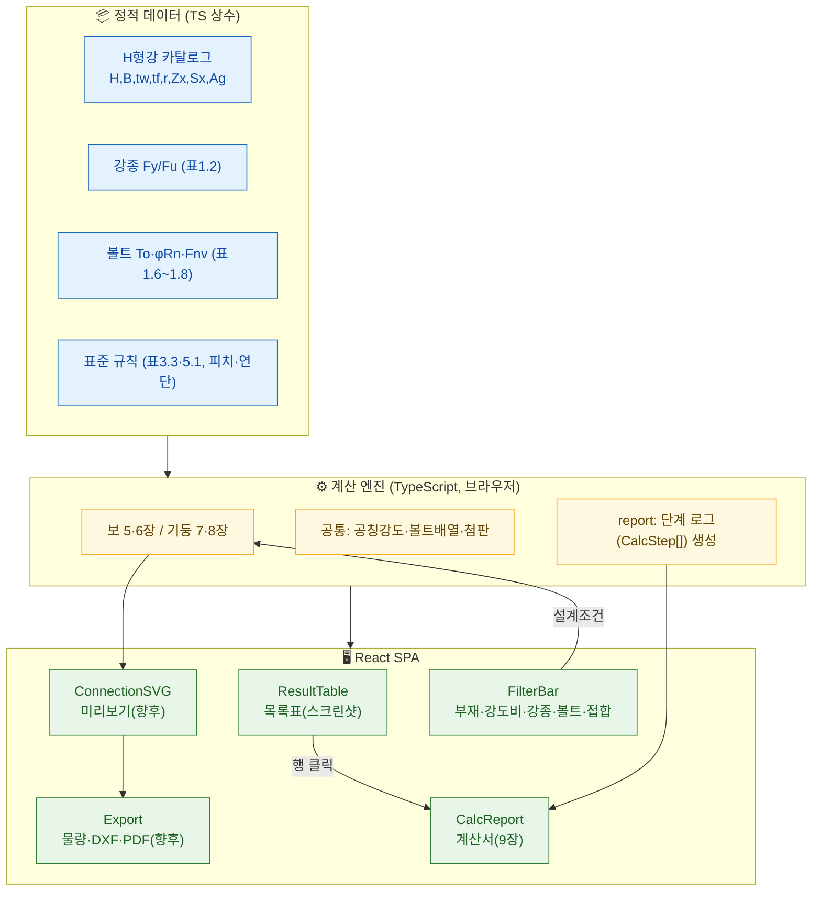
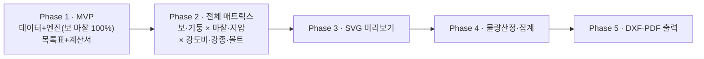

# 고력볼트 표준접합 설계 웹서비스 — 전반 계획

> **기반 자료**: [`01_설계조건_표준화방안_1-4장.md`] · [`02_설계_프로시저_5-8장.md`] · [`03_설계_WORKFLOW.md`] · [`04_WORKFLOW_입출력_시각화.md`] · PDF 제9장 예제 / 부록 설계표
> **확정 방향**: ① TypeScript 단일 SPA(브라우저 엔진, 정적 배포) · ② 실시간 계산 엔진(단일 source of truth) · ③ 고정 카탈로그(표준 H형강 ~100개)

---

## 1. 서비스 개요

한국강구조학회 『고력볼트 표준접합 설계편람(KBC-09)』을 **인터랙티브 웹**으로 구현한다.

- **목록 화면**: 첨부 이미지와 같은 표준접합부 설계표 (예: `보 100% SHN490 F10T`)
- **상세 화면**: 행 클릭 → 해당 부재의 **단계별 계산서**(PDF 제9장 예제 형식)
- **향후**: ④ 접합 상세 **SVG 미리보기** → ⑤ **물량산정** → ⑥ **CAD(DXF) 다운로드** / PDF 계산서

**핵심 설계 원칙**: 하나의 **계산 엔진**이 목록표의 값과 상세 계산서의 단계를 **동시에** 생성한다(단일 진실 공급원). 표와 계산서가 절대 어긋나지 않는다.

---

## 2. 아키텍처



- **배포**: Vite 정적 빌드 → Vercel / Netlify / GitHub Pages. 서버·DB 불필요(초기).
- **오프라인·즉시 계산**: 모든 데이터·로직이 번들에 포함.
- **확장 지점**: 향후 CAD/PDF 대량 출력이 무거워지면 경량 Python 서비스만 선택적 추가(하이브리드로 승격 가능).

---

## 3. 데이터 모델

### 3-1. 설계조건 (필터 → 엔진 입력)
```ts
interface DesignCondition {
  member: '보' | '기둥';
  strengthRatio: 1.0 | 0.85 | 0.7 | 0.75 | 0.5;   // 보 1.0/0.85/0.7, 기둥 1.0/0.75/0.5
  steel: 'SHN490' | 'SS400' | 'SM490' | ...;       // 표 1.2
  bolt: 'F10T' | 'F13T';
  jointType: '마찰' | '지압';
  sectionType: '압연' | '용접';
}
```

### 3-2. H형강 카탈로그 (핵심 데이터 자산)
```ts
interface HSection {
  name: string;        // "H-386x299x9x14"
  H: number; B: number; tw: number; tf: number; r: number;
  Ag: number;          // 총단면적 mm²
  Zx: number; Sx: number;   // 소성/탄성 단면계수 mm³
  nominalWidth: number;     // 플랜지 공칭폭 → 표3.3 매칭
}
```
> ⚠ **가장 먼저 확보할 데이터**: 표준 압연 H형강 ~100개의 치수·단면성능. **부록 표(부록 I)** 또는 KS 형강 규격표에서 추출/정리. Zx·Sx·r·Ag가 계산의 필수 입력.

### 3-3. 계산 결과 (목록표 행 = 스크린샷 컬럼과 1:1)
```ts
interface DesignResult {
  section: string;
  Mu_kNm: number; Vu_kN: number;   // 설계강도(휨모멘트/전단력)
  boltDia: 16 | 20 | 22;           // 볼트 do
  flange: {
    bolt: { m: number; n: number };      // 볼트열 m×n
    gauge: { g1: number; g2?: number };  // 게이지
    outerPlate: { t: number; w: number; L: number };  // 두께×폭×길이
    innerPlate?: { t: number; w: number; L: number };
  };
  web: {
    bolt: { m: number; n: number };
    Pc: number;                          // 상하 피치
    plate: { t: number; d: number; w: number };  // 두께×춤×너비
  };
  steps: CalcStep[];   // ← 상세 계산서용
}
```

### 3-4. 계산 단계 (계산서의 한 줄 = 9장 예제 한 줄)
```ts
interface CalcStep {
  section: '가'|'나'|'다'|'라'|...;   // 9장 예제의 구획
  label: string;        // "접합부 소요휨강도"
  formula: string;      // "Mu = α·φ·Mn"
  substitution: string; // "= 1.0×0.9×605"
  value: number; unit: string;
  ref: string;          // "5.2.3절 / 표 1.7"
  check?: 'OK' | 'NG';  // 판정이 있는 단계
}
```
→ **표는 `DesignResult`의 요약 필드**, **계산서는 `steps` 배열**을 렌더. 둘 다 같은 엔진 호출에서 나온다.

---

## 4. 계산 엔진 (5~8장 절차의 코드화)

### 폴더 구조
```
src/
  data/
    sections.ts      # H형강 카탈로그
    materials.ts     # 강종 Fy/Fu (표1.2)
    bolts.ts         # To, φRn(표1.7), Fnv(표1.8)
    standards.ts     # 표3.3, 표5.1, 피치·연단·첨판두께 규격
  engine/
    types.ts         # DesignCondition, HSection, DesignResult, CalcStep
    nominal.ts       # 공칭휨강도(5.2)/공칭압축강도(7.2·7.6)
    boltStrength.ts  # 미끄럼(2.4)/지압(2.5·2.6) 강도
    flange.ts        # 플랜지 이음 (소요축력→첨판→볼트→길이)
    web.ts           # 웨브 이음 (배치 검토 루프 / 지압 가정-검토 루프)
    designBeam.ts    # 5·6장 오케스트레이션
    designColumn.ts  # 7·8장 오케스트레이션
    report.ts        # CalcStep 로깅 유틸
    index.ts         # designConnection(condition, section) → DesignResult
  components/ ...
```

### 엔진 진입점 (단일 API)
```ts
function designConnection(cond: DesignCondition, sec: HSection): DesignResult
// 목록표: sections.map(s => designConnection(cond, s))  → 표 렌더
// 계산서: designConnection(cond, clickedSection).steps  → 계산서 렌더
```

### 절차 매핑 (문서 → 코드)
| 문서 절 | 엔진 함수 | 산출 |
|---|---|---|
| 5.2 / 7.2·7.6 | `nominal.ts` | Mn / 소요압축강도 → Mu·Puf |
| 2.4 / 2.5·2.6 | `boltStrength.ts` | φRn(미끄럼/지압) |
| 5.3~5.5 | `flange.ts` | 첨판 폭·두께·길이, 볼트 m×n |
| 5.6~5.9 | `web.ts` | 웨브 볼트 배열, 첨판 춤·두께·너비 |
| 6·8장 | `flange/web` 분기 | 지압강도·재산정 루프 |

---

## 5. 화면 설계

### 5-1. 목록 화면 (스크린샷 재현)

- 상단 **필터바**: 부재 / 강도비 / 강종 / 볼트등급 / 접합방식 / (압연·용접) 토글
- **표 헤더**: 스크린샷과 동일 — 마찰접합 ▸ 플랜지(볼트열, 게이지, 외첨판, 내첨판) ▸ 웨브(볼트열, Pc, 첨판)
- 정렬·검색(단면명), 페이지네이션(스크린샷의 1/4 대응)

### 5-2. 상세 계산서 화면 (제9장 형식)
- 헤더: `9.x 압연형강 보 마찰접합 / 100% 전강도 / SHN490 / H-386×299×9×14 / F13T`
- **가) 소요휨강도·플랜지 소요축력 → 나) 첨판 폭·두께 → 다) 볼트 설계강도·배열 → 라) 두께조정·길이 → 웨브 …**
- 각 줄: `수식 → 대입 → 결과값(단위) → 판정(OK/NG) → 근거조항`
- 라우팅: `/` (목록) · `/report/:sectionId?cond=...` (계산서). 인쇄용 레이아웃(향후 PDF).

---

## 6. 향후 확장 설계

### 6-1. SVG 미리보기 (Phase 3)
- 입력: `DesignResult`의 첨판 치수 + 볼트 배열(m·n·피치·게이지·연단)
- 출력: 편람 [그림 3.1/3.2](플랜지 평면·입면), 웨브 배치도를 **SVG로 렌더**
- 표준 기하 규칙(연단 40·피치 60/45·이격 10)이 이미 확정 → 파라메트릭 드로잉 컴포넌트 `ConnectionSVG`

### 6-2. 물량산정 (Phase 4)
- 부재별: 볼트 수량(등급·지름별 집계), 첨판 물량(두께×폭×길이×매수 → 중량 = 부피×7,850kg/m³)
- 프로젝트 단위 집계표 → CSV/Excel 내보내기(`xlsx`/`SheetJS` 브라우저 생성)

### 6-3. CAD(DXF) 다운로드 (Phase 5)
- 브라우저 DXF 생성 라이브러리(예: `@tarikjabiri/dxf`, `dxf-writer`)로 플랜지/웨브 첨판 외형 + 볼트 구멍 출력
- 계산서 PDF: `react-to-print` 또는 `pdfmake`(클라이언트) — 무거우면 경량 Python 서비스로 이관

---

## 7. 단계별 로드맵



| Phase | 범위 | 완료 기준(검증) |
|---|---|---|
| **1 · MVP** | H형강 카탈로그 + 엔진(보·마찰·100%) + 목록표 + 계산서 | **9.1 예제와 수치 완전 일치** |
| **2 · 매트릭스** | 6·7·8장(지압·기둥), 강도비·강종·볼트 전체 | **9.1~9.8 예제 8종 모두 일치** |
| **3 · SVG** | 플랜지/웨브 접합 상세도 파라메트릭 렌더 | 편람 그림과 배치 일치 |
| **4 · 물량** | 볼트·첨판 물량 집계, 내보내기 | 수동 검산 일치 |
| **5 · CAD/PDF** | DXF·PDF 다운로드 | CAD에서 열림·치수 정확 |

---

## 8. 검증 전략 (골든 테스트)

**PDF 제9장 예제 8종 = 엔진의 정답지(oracle).** 각 예제의 최종 수치를 단위 테스트로 고정.

예) **9.1** 압연형강 보 마찰 100% SHN490 H-386×299×9×14 F13T:
- `Mp = Fy·Zx = 325×1,920,000 = 624 kN·m`, `Mn` 국부좌굴 검토(플랜지 비콤팩트/웨브 콤팩트)
- `Mu = 1.0×0.9×605 = 545 kN·m` → `Puf = Mu/dm = 1,465 kN`
- 볼트: 공칭폭 300 → **M22, 4열 엇모**, `φRn = 0.85×0.5×1.0×259×2 = 220 kN`, **2행**
- 외첨판 **9×300×440**, 내첨판 **12×120×440**
- 웨브: `Vn = 1.0×0.9×0.6×325×386×9 = 610 kN` → 볼트 요구개수 …

→ `expect(result.flange.outerPlate).toEqual({t:9,w:300,L:440})` 형태로 8종 전부 회귀 테스트(Vitest).

---

## 9. 기술 스택

| 영역 | 선택 | 비고 |
|---|---|---|
| 프레임워크 | **React 19 + Vite + TypeScript** | 이전 스택과 동일, 학습비용 0 |
| 라우팅 | React Router | 목록/계산서 |
| 상태 | 로컬 상태 + URL 쿼리(설계조건) | 서버 불필요, 링크 공유 가능 |
| 표/UI | 경량 커스텀 또는 TanStack Table | 정렬·필터 |
| 수식 표기 | KaTeX(선택) | 계산서 가독성 |
| 테스트 | **Vitest** | 9장 골든 테스트 |
| 내보내기(향후) | SheetJS(물량), dxf-writer(CAD), pdfmake(계산서) | 모두 브라우저 |
| 배포 | Vercel/Netlify 정적 | CI 빌드 |

---

## 10. 리스크 · 의사결정 포인트

| 항목 | 내용 | 대응 |
|---|---|---|
| **단면성능 데이터** | Zx·Sx·r·Ag 100개 확보가 선행 필수 | 부록 I 또는 KS 형강표에서 우선 정리(Phase 1 착수 전) |
| 세장비 한계식 계수 | 5.2 λpf·λrf 등 원문 그림 수식 재확인 필요 | PDF 20~21쪽·9장 예제로 교차검증 |
| 지압 웨브 재산정 루프 | 가정→검토 수렴 로직 | 반복 상한·수렴조건 명시, 9.2/9.4 예제로 검증 |
| 표준 외 케이스 | 과대·슬롯구멍, 나사부 전단면 포함 | 범위 밖 표시(비활성), 별도 설계 안내 |
| 용접 H형강 | 필렛 처리·공칭폭 매칭 차이 | 압연 우선 구현 후 용접 분기 추가 |

---

## 11. 착수 순서 (Phase 1 실행안)

1. **데이터 확정**: `sections.ts`(H형강 ~100), `materials.ts`, `bolts.ts`, `standards.ts` 정리
2. **타입 정의**: `engine/types.ts`
3. **엔진 코어**: `nominal.ts` → `boltStrength.ts` → `flange.ts` → `web.ts` → `designBeam.ts`(마찰·100%)
4. **골든 테스트**: 9.1 예제 회귀 테스트 통과
5. **UI**: `FilterBar` → `ResultTable`(스크린샷) → 행 클릭 → `CalcReport`
6. 배포(정적) 후 Phase 2 매트릭스 확장

---
*본 계획은 docs의 1~4번 문서(설계 논리)를 코드로 옮기는 로드맵이다. 엔진의 정확성 기준은 항상 제9장 예제다.*
