# 플랜지 1열 배치 — 블록전단 파단선 패턴

> 근거: AISIsplice Appendix C. **원 = 볼트 위치, 빗금 = 뜯겨나가는(탈락) 블록.**
> 빗금 영역은 **볼트선(전단면)을 따라 한덩어리로 찢어짐**.
> 시각 확인: [`docs/파단선/pattern/index.html`](파단선/pattern/index.html) · 코드: [`scripts/bs_pattern_1row.mjs`](../scripts/bs_pattern_1row.mjs)
> 예시 단면: **H-450×200×9×14 (M20)** — 게이지 g1=120(선 ±60), n=4, 피치 60, 연단 40, 폭 B=200.

## 표기 규약
| 기호 | 의미 | 강도항 |
|---|---|---|
| 🔴 빨강 실선 | **전단 파단면** (하중 Pf와 ∥, 게이지선 따라) | `min(0.6·Fu·Anv, 0.6·Fy·Agv)` |
| 🔵 파랑 실선 | **인장 파단면** (하중 Pf와 ⊥) | `U_bs·Fu·Ant` |
| 🟡 빗금 | **탈락(뜯김) 블록** — 한덩어리로 이탈 | — |
| ◀ Pf | 플랜지 축력(**하중 방향 = 왼쪽**) | — |
| ℄ | 이음면(splice joint) | — |

- 좌표: `x` = 하중축(자유단 0 → 이음 Xj), `y` = 폭(웨브 CL = 0), 게이지선 = ±a (a = g1/2).
- `xt = edge + (n−1)·pitch` (최이음측 볼트열 = 인장 파단면 위치).

---

## 1. 외부 이음판 (Outer Flange Splice Plate)

### Path 1 — L형 (U_bs 0.5)
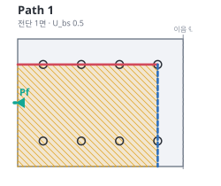

- 🔴 전단: **상부 게이지선 1면** (볼트선 따라 찢김)
- 🔵 인장: 오른쪽, 상부선 → 하부선 통과 → **하부 연단**까지(↓)
- 🟡 탈락: 상부 볼트선 ~ 하부 연단 **한덩어리**

```js
{ id:'P1', ubs:0.5,
  shear:   [{ y: a, x0: 0, x1: xt }],   // 상부 게이지선 1면
  tension: [vLine(xt, a, -ym)],         // 상부선 → 하부선 통과 → 연단
  tear:    [rect(0, xt, a, -ym)] }
```

### Path 2a — U형 내측인장 (U_bs 1.0)
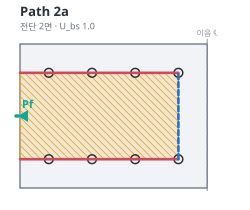

- 🔴 전단: 상·하 게이지선 2면
- 🔵 인장: 두 게이지선 사이(내측)
- 🟡 탈락: 두 게이지선 사이 밴드

```js
{ id:'P2a', ubs:1.0,
  shear:   [{ y:-a, x0:0, x1:xt }, { y:a, x0:0, x1:xt }],
  tension: [vLine(xt, -a, a)],
  tear:    [rect(0, xt, -a, a)] }
```

### Path 2b — U형 외측연단 (U_bs 1.0)
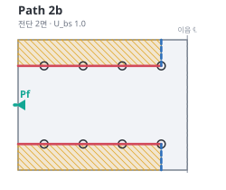

- 🔴 전단: 상·하 게이지선 2면
- 🔵 인장: 각 선 → 판 외측연단(상·하)
- 🟡 탈락: 바깥쪽 2밴드

```js
{ id:'P2b', ubs:1.0,
  shear:   [{ y:-a, x0:0, x1:xt }, { y:a, x0:0, x1:xt }],
  tension: [vLine(xt, a, ym), vLine(xt, -a, -ym)],
  tear:    [rect(0, xt, a, ym), rect(0, xt, -a, -ym)] }
```

---

## 2. 내부 이음판 (Inner Flange Splice Plate) — 웨브 양측 2매

### Path 4 (U_bs 0.5)
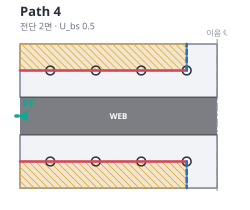

- 🔴 전단: 각 판 게이지선 1면(웨브 양측 2매)
- 🔵 인장: 게이지선 → **판 외측연단**
- 🟡 탈락: 각 판 외측밴드(웨브 중앙 표기)

```js
{ id:'P4', ubs:0.5,
  shear:   [{ y:a, x0:0, x1:xt }, { y:-a, x0:0, x1:xt }],
  tension: [vLine(xt, a, outer), vLine(xt, -a, -outer)],  // outer = a + innerBand/2
  tear:    [rect(0, xt, a, outer), rect(0, xt, -a, -outer)] }
```

---

## 3. 부재 플랜지 (Girder Flange)

### Path 6 (U_bs 1.0)
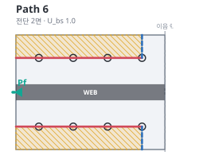

- 🔴 전단: 상·하 게이지선 2면
- 🔵 인장: 각 선 → 판 외측연단
- 🟡 탈락: 바깥쪽 2밴드(웨브 중앙 표기)

```js
{ id:'P6', ubs:1.0,
  shear:   [{ y:a, x0:0, x1:xt }, { y:-a, x0:0, x1:xt }],
  tension: [vLine(xt, a, ym), vLine(xt, -a, -ym)],
  tear:    [rect(0, xt, a, ym), rect(0, xt, -a, -ym)] }
```

---

## 요약표
| Path | 요소 | 전단면 | 인장면 | 탈락블록 | U_bs |
|---|---|---|---|---|---|
| **1** | 외부 | 상부선 1면 | 상부선→하부 연단 | 상부선~하부 연단 한덩어리 | 0.5 |
| **2a** | 외부 | 상·하선 2면 | 두 선 사이 | 중앙 밴드 | 1.0 |
| **2b** | 외부 | 상·하선 2면 | → 외측연단 | 바깥쪽 2밴드 | 1.0 |
| **4** | 내부(2매) | 각 판 1면 | → 판 외측연단 | 각 판 외측밴드 | 0.5 |
| **6** | 부재 | 상·하선 2면 | → 판 외측연단 | 바깥쪽 2밴드(웨브 중앙) | 1.0 |

## 데이터 구조 (CheckFig 포팅용)
```ts
type ShearLine = { y: number; x0: number; x1: number };   // 전단선(수평, ∥ Pf)
type Polyline  = [number, number][];                       // 인장선 / 탈락블록 다각형
type BsPath = { id: string; ubs: number;
  shear: ShearLine[]; tension: Polyline[]; tear: Polyline[] };
```
순수 함수 `outerPaths1Row(f)` · `innerPaths1Row(f)` · `girderPaths1Row(f)` 가
위 `BsPath[]` 를 반환 → 렌더러 `renderPath()`(해치=45° 해석적 클리핑)로 SVG 작도.

---

# 플랜지 2열 배치 — 블록전단 파단선 패턴

> 게이지선 **4개**: ±내측(aIn) · ±외측(aOut). 코드: [`scripts/bs_pattern_2row.mjs`](../scripts/bs_pattern_2row.mjs) · 아티팩트 도해 `docs/파단선/pattern2/`.
> 예시 단면: **H-400×400×13×21 (M22)** — 게이지선 ±75(내)·±160(외), n=4, 피치 60, 연단 40, B=400.
> 내부판 스트립 [끝선 35, 외측연단 195].

## 5. 외부 이음판 (Outer)
| Path | 이미지 | 전단면 | 인장면 | 탈락블록 | U_bs |
|---|---|---|---|---|---|
| **1** | 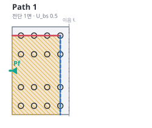 | 상부 외곽선 1면 | 우측→하부 연단 | 한덩어리(외곽선~하단) | 0.5 |
| **2a** | 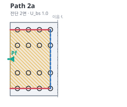 | 상·하 외곽선 2면 | 내측 | 중앙 밴드 | 1.0 |
| **2b** | 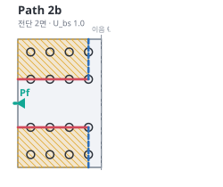 | 상·하 **내측** 게이지선 2면 | 외측연단~안쪽 | 바깥쪽 2밴드(내곽선↔연단) | 1.0 |
| **3** | 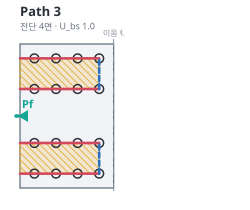 | 내·외곽선 4면 | 밴드분할 | 내~외곽선 2밴드 | 1.0 |

## 6. 내부 이음판 (Inner) — 웨브 양측 2매
| Path | 이미지 | 전단면 | 인장면 | 탈락블록 | U_bs |
|---|---|---|---|---|---|
| **4** | 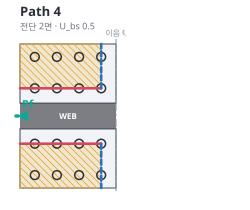 | 각 판 내측선 2면 | 판 외측연단 | 각 판(내측선~연단) | 0.5 |
| **5a** | 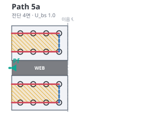 | 각 판 내·외 4면 | 내측 | 내~외선 밴드 | 1.0 |
| **5b** | 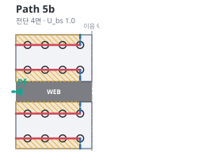 | 각 판 내·외 **4면** | 외곽선→연단 · 내곽선→끝선 | **2스트립**(게이지선 사이 미탈락) | 1.0 |

## 7. 부재 플랜지 (Girder)
| Path | 이미지 | 정의 | U_bs |
|---|---|---|---|
| **6** | 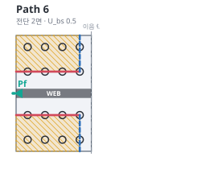 | **Path 4와 동일** — 내측선 전단 + 외측연단(웨브 양측 2블록) | 0.5 |
| **7** | 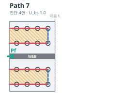 | **Path 5a와 동일** — 내·외 4면 전단 + 내측 인장(웨브 양측) | 1.0 |

## 8. 코드 (핵심)
```js
// 게이지선 4개: aIn, aOut · outerEdge=내부판 외측연단 · innerEdge=내부판 웨브측 끝선
// 외부 Path 2b — 내측 게이지선 전단 + 외측연단~안쪽 2밴드
{ id:'P2b', ubs:1.0, shear:[S(aIn),S(-aIn)],
  tension:[vLine(xt,aIn,ym),vLine(xt,-aIn,-ym)], tear:[rect(0,xt,aIn,ym),rect(0,xt,-aIn,-ym)] }

// 내부 Path 5b — 게이지선 4면 전단 + 각 판 2스트립(외곽선→연단, 내곽선→끝선), 사이 미탈락
{ id:'P5b', ubs:1.0, shear:[S(aOut),S(aIn),S(-aIn),S(-aOut)],
  tension:[vLine(xt,outerEdge,aOut),vLine(xt,aIn,innerEdge),vLine(xt,-innerEdge,-aIn),vLine(xt,-aOut,-outerEdge)],
  tear:[rect(0,xt,aOut,outerEdge),rect(0,xt,innerEdge,aIn),rect(0,xt,-aIn,-innerEdge),rect(0,xt,-outerEdge,-aOut)] }

// 부재 Path 6 = Path 4 (웨브 양측 2블록) · Path 7 = Path 5a
```

---

# 웨브 이음판 (Web Splice Plate) — 1열 / 2열

> 입면. 하중 **Vu = 수직 전단**. 웨브 수평력 **H=0**(단순전단 이음)이므로 수직 V블록만,
> **이음면 기준 한쪽 절반**만 검토. 코드: [`scripts/bs_pattern_web.mjs`](../scripts/bs_pattern_web.mjs).
> 🔴 전단면 = 수직(∥Vu, 볼트열 따라) · 🔵 인장면 = 수평(⊥Vu, 최하단행) · 🟡 탈락블록.

| 배치 | 이미지 | 전단면 | 인장면 | 탈락블록 | U_bs |
|---|---|---|---|---|---|
| **1열** | 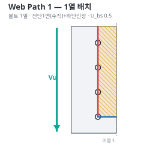 | 볼트열 수직 1면 | 최하단행 수평 | 볼트열~이음면 스트립 | 0.5 |
| **2열** | 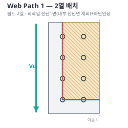 | **외곽열만** 수직 1면(내부 전단면 제외) | 최하단행 수평 | 외곽열~이음면 블록(내부열 포함) | — |

- Web Path 1(수직 V블록)만 검토 — **Web Path 2·3(H블록)·Girder Web Path 4·5는 H=0으로 제외**.
- `φRn = φ[min(0.6F_u·A_nv, 0.6F_y·A_gv) + U_bs·F_u·A_nt] × 2매`(양면 이음판).

```js
// 웨브 입면: v=축(이음면0→좌), u=춤(Vu 아래). cols=볼트열 축위치, shearCols=전단 표시 열.
// 1열: 볼트 1열 → 전단 1면          { cols:[c], shearCols:[c] }
// 2열: 볼트 2열, 외곽열만 전단      { cols:[cIn,cOut], shearCols:[cOut] }  // 내부 전단면 제외
// 전단면(수직) = 볼트열 따라, 인장면(수평) = 최하단행, 탈락블록 = 외곽열~이음면
```

---

# 플랜지 엇모(staggered) 배치 — 블록전단 파단선 패턴

> 볼트 지그재그 → 인장 파단면이 **경사(계단)**로 엇갈림 볼트 통과. 코드: [`scripts/bs_pattern_stagger.mjs`](../scripts/bs_pattern_stagger.mjs).
> 예시 단면: **H-700×300×13×24 (M22)** — 게이지선 ±65(내·off45)·±115(외·off0), n=3, 피치90. 내부판 [끝선 40, 외측연단 150].
> 🔴 전단(∥Pf, 게이지선) · 🔵 인장(⊥Pf, **경사 폴리라인**) · 🟡 탈락블록 · Pf=왼쪽.

## 9. 외부 이음판 (Outer)
| Path | 이미지 | 정의 | U_bs |
|---|---|---|---|
| **1a** | 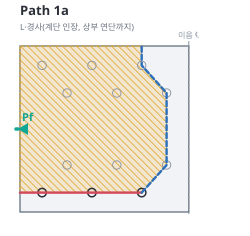 | L·전 계단(내측볼트 통과), 상단 외곽열 마감 | 0.5 |
| **1b** | 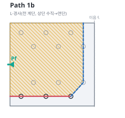 | L·전 계단, 상단 **수직**(내측열)→연단 | 0.5 |
| **2a** | 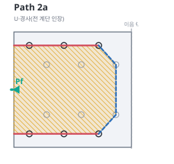 | U·전 계단(내측인장) | 1.0 |
| **2b** | 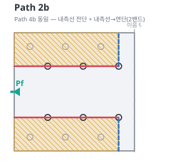 | = Path 4b — 내측선 전단 + 내측선→연단 2밴드 | 1.0 |
| **2c** | 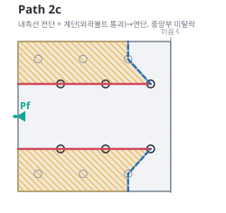 | 내측선 전단 + 계단(외곽볼트 통과)→연단, 중앙 미탈락 | 1.0 |
| **3** | 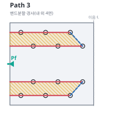 | 밴드분할·경사(내·외 4면) | 1.0 |

## 10. 내부 이음판 (Inner) — 웨브 양측 2매
| Path | 이미지 | 정의 | U_bs |
|---|---|---|---|
| **4a** | 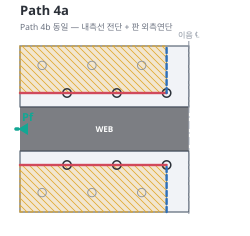 | 내측선 전단 + 판 외측연단(**직진**) | 0.5 |
| **4b** | 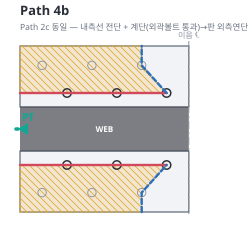 | = Path 2c — 내측선 전단 + 계단(외곽볼트 통과)→연단 | 0.5 |
| **5a** | 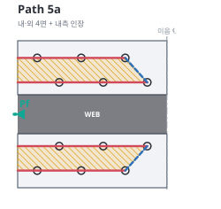 | 내·외 4면 + 내측 인장 | 1.0 |
| **5b** | 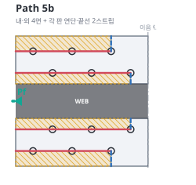 | 내·외 4면 + 각 판 2스트립(외곽선→연단·내곽선→끝선) | 1.0 |

## 11. 부재 플랜지 (Girder)
| Path | 이미지 | 정의 | U_bs |
|---|---|---|---|
| **6a** | 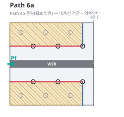 | = 4a(웨브 양측·직진) | 0.5 |
| **6b** | 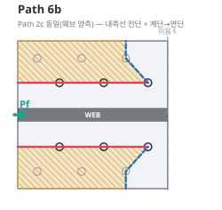 | = 4b·2c(웨브 양측·계단) | 0.5 |
| **7** | 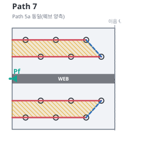 | = 5a(웨브 양측) | 1.0 |
| ~~8~~ | — | ~~= 5b(웨브 양측·각 반 2스트립)~~ **삭제** — 부재 플랜지 내측 스트립이 웨브와 일체(자유단 없음)라 블록 미형성 | — |

> **엇모 요점:** 인장 파단면이 `near-joint 볼트`(외곽 x=220 · 내측 x=265)를 계단으로 통과.
> `nj(y)=[lastOf(y), y]`, 계단 폴리라인으로 탈락블록 우측 경계 형성. 순단면은 s²/4g 보정(B4.3b).

---

> **✅ 완료:** 전체 패턴(1열·2열·엇모·웨브)을 단일 소스 `bsPatterns.ts`로 앱 `CheckFig.tsx`에 통합(상세계산서 도해 + 후보 Path 전체 φRn·DCR 산출). 엇모 내부(4a·4b·5a·5b, 경사 인장)·부재(6a·6b·7) 완비, 웨브 탈락블록 빗금 정상 렌더. (부재 Path 8은 내측 스트립이 웨브와 일체·자유단 없음으로 삭제.) 부재웨브 블록전단(구 WM2)은 부재웨브가 상·하 플랜지와 일체(자유단 없음)라 블록이 형성되지 않아 검토에서 제외 — 자유단을 갖는 웨브 이음판(WP1)만 블록전단 대상.
